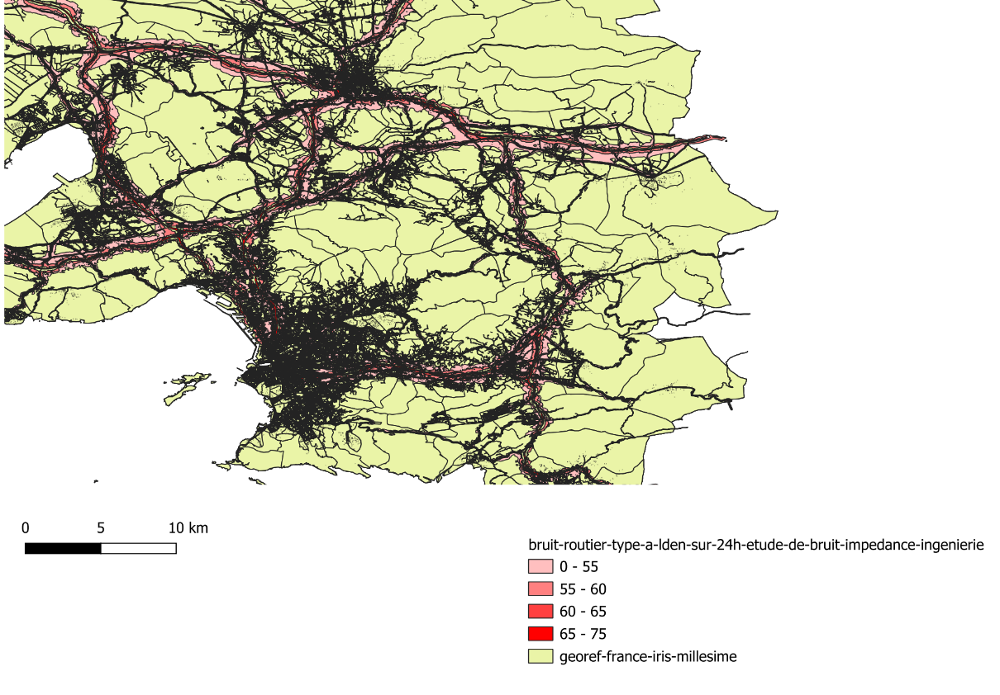
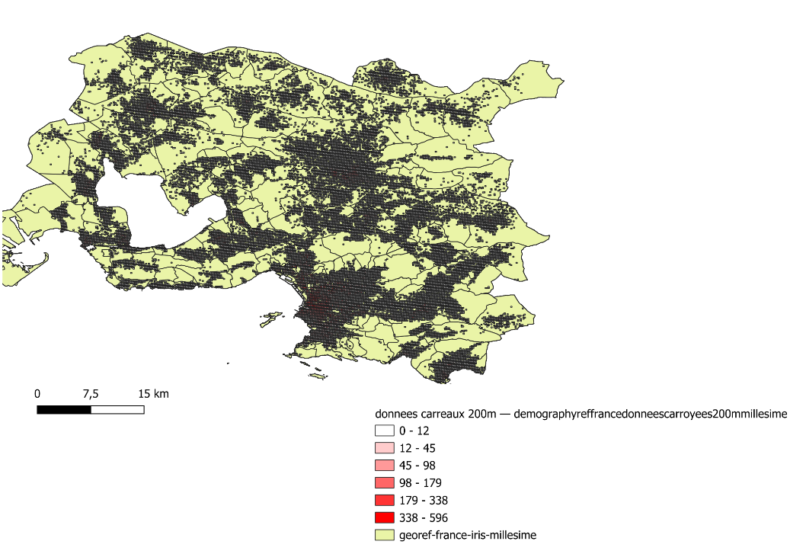
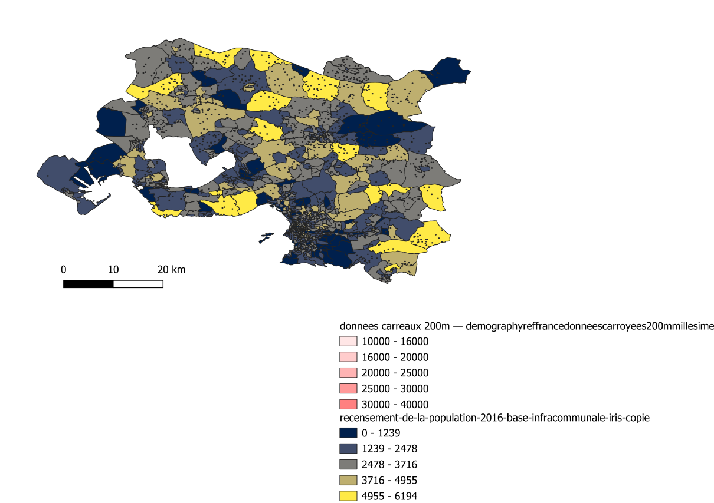

# Les nuisances sonores dans la métropole de Marseille

RENNES Léane Projet SIG L3 Géographie
## Présentation
Ce projet analyse les inégalités d’exposition au bruit routier dans la métropole d’Aix-Marseille-Provence.

## Problématique
Existe-t-il une inégalité spatiale face aux nuisances sonores ?

## Cartes

### Bruit routier

Cette carte montre que les niveaux de bruit les plus élevés se concentrent le long des grands axes de circulation. Le bruit est principalement lié aux infrastructures de transport, et son intensité varie en fonction du trafic et de la densité urbaine. L’indicateur Lden utilisé correspond à un niveau sonore moyen pondéré sur 24 heures

### Densité de population

Cette carte met en évidence une forte concentration de la population dans le centre de Marseille, où les densités les plus élevées sont observées. À l’inverse, les espaces périphériques apparaissent moins densément peuplés, traduisant une organisation urbaine polarisée autour du cœur métropolitain.

### Revenus

Cette carte met en évidence de fortes inégalités au sein de la métropole. Certains territoires présentent des niveaux de revenus élevés, tandis que d’autres apparaissent plus modestes, révélant une organisation sociale contrastée de l’espace urbain.

## Conclusion
La mise en relation de ces cartes permet d’analyser les inégalités d’exposition au bruit, en croisant la répartition de la population, les niveaux sonores et les caractéristiques socio-économiques.
Les résultats montrent une forte concentration du bruit dans les zones urbaines denses et le long des axes routiers.
